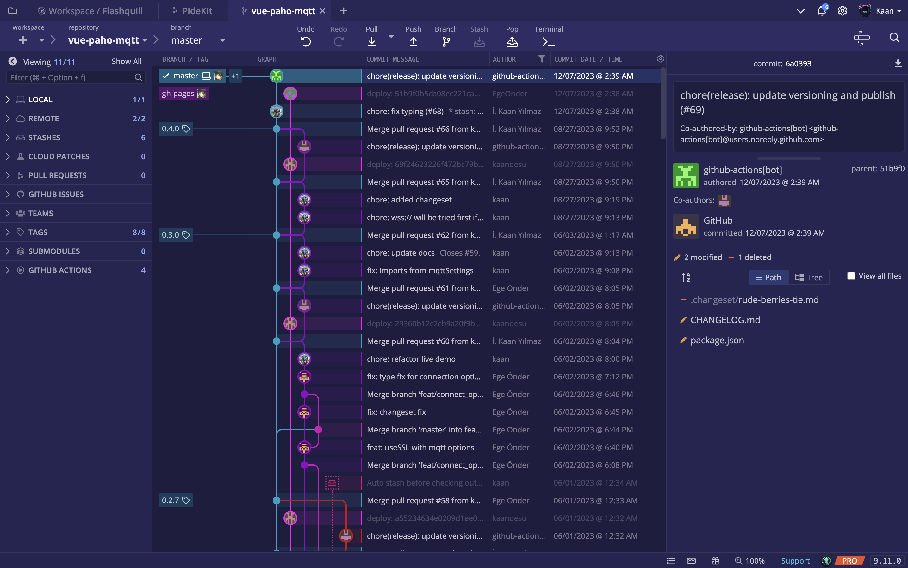

## OVERVIEW

In addition to the default themes, GitKraken now supports custom user-defined themes! Each of the .jsonc-default theme files you see in this folder can act as a template "base" for your new custom theme.

# Installation

- You can find all available themes in the [Themes](https://github.com/kaandesu/antalyanight-gitkraken-theme/tree/master/Themes) folder.
- Copy the \*.jsonc file of your desired theme in your GitKraken theme folder. On Windows it's usually located at: `C:\Users\*Username*\AppData\Roaming\.gitkraken\themes`. On Linux/MacOS it's located at: `~/.gitkraken/themes`.
- Select your theme under `Preferences -> UI Customization`.
- See also the official GitKraken [Documentation](https://support.gitkraken.com/start-here/themes/).

# Themes Details

### [Antalya Night - Night](https://github.com/kaandesu/antalyanight-gitkraken-theme/blob/main/Themes/antalya-night-dark.jsonc)

# 
